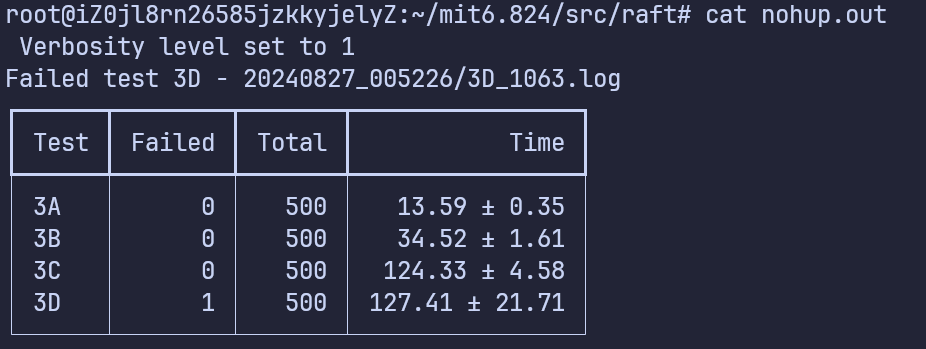
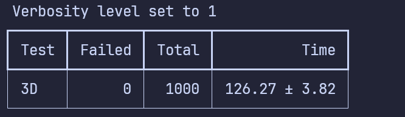
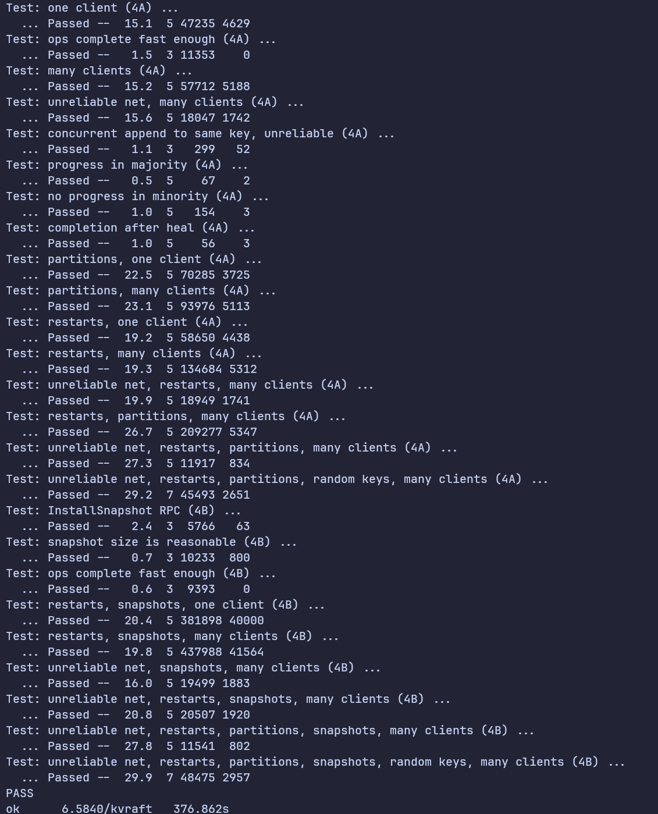
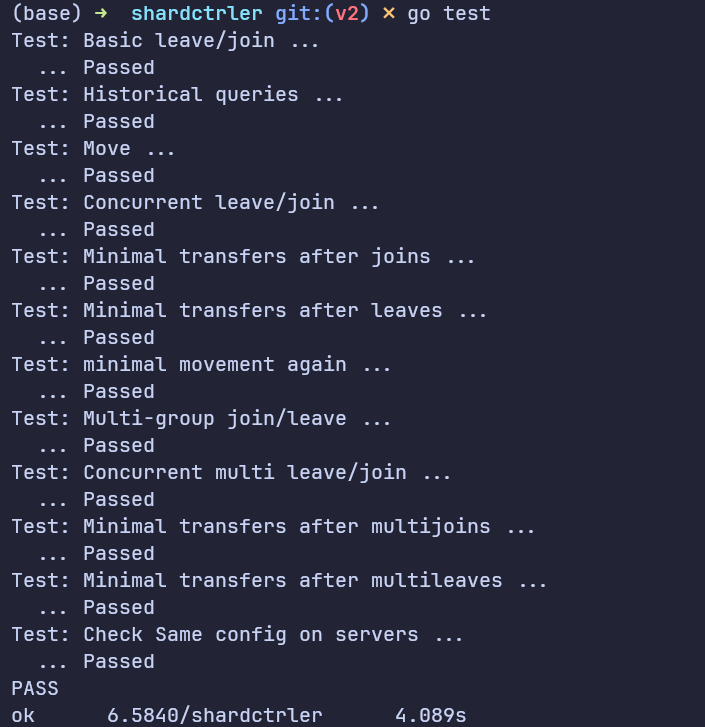
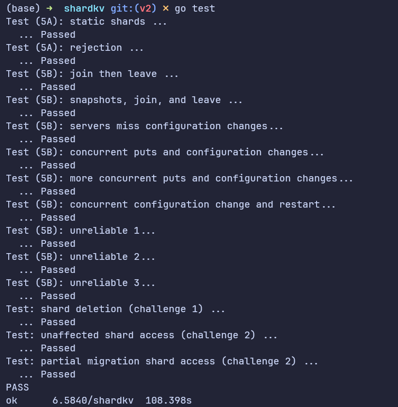

# MIT-6.5840 2024春 (原MIT6.824)

## Lab5业务架构

> ref:https://www.cnblogs.com/pxlsdz/p/15685837.html

- 业务数据会切割为若干个`shard`(实验中固定`NShards=10`且映射关系保持不变)
- 每个`group`负责存储一个或多个`shard`
- 每个`group`包含若干个`server`，对应物理服务器，对该组负责的`shard`做冗余备份
- 控制层`Shardctrler`负责配置`group`的上线和下线，以及`shard`在`group`之间的迁移

## 测试结果

- [x] Lab1:MapReduce

- [x] Lab2:Key/Value Server

- [x] Lab3:Raft

- [x] Lab 4:Fault-tolerant Key/Value Service

- [x] Lab 5:Sharded Key/Value Service

